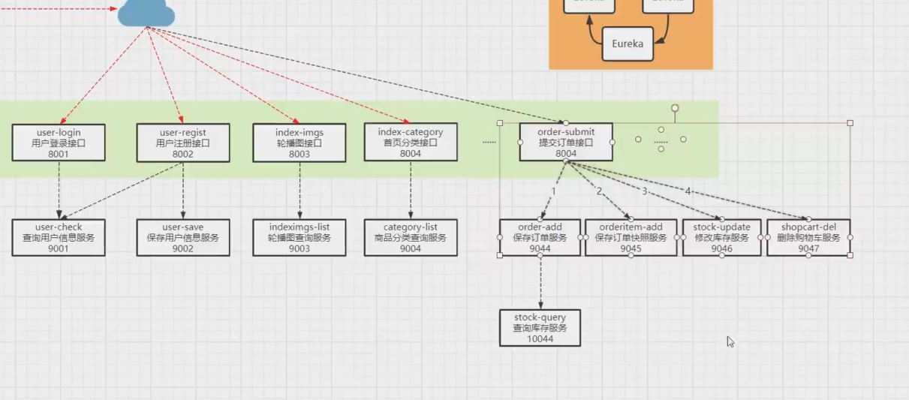

登录：

前端部分校验流程：

v-model实时渲染input框

设置isRight判断账号密码的正确性，周期登陆前可以先判断这个参数的值是否为true

window.location.href = xxxUrl;用于跳转网页

@keyUp 实时校验账号密码是否为空，长度是否合法

@click 作为提交按钮执行的函数，先判断isRight参数的正确性，避免一些无效的访问后端服务器的行为，然后再格式正确的情况下进行后端的axios的异步请求后端数据

axios请求后端数据的步骤

```javascript
<script type="text/javascript">
    var baseUrl = "http://localhost:8080/";
	var url = baseUrl + "/user/login";
	axios.get(
        	url,
            {
                params:{
                    username:vm.username, 
                    password:vm.password
                }
    		}
    		)
		 .then(
        (res)=>{
        console.log(res);
    });
</script>
```

设置cookie

```javascript
var operator = "=";
function setCookieValue(key,value){
	document.cookie = key+operator+value;
}
function getCookieValue(keyStr){
	var value = null;
	var s = window.document.cookie;
	var arr = s.split("; ");
	for(var i=0; i<arr.length; i++){
		var str = arr[i];
		var k = str.split(operator)[0];
		var v = str.split(operator)[1];
		if(k == keyStr){
			value = v;
			break;
		}
	}
	return value;
}
```


注册阶段采用事务，要么成功，要么全失败

注册和登录的代码

```javascript
@Transactional
    public ResultVO userResgit(String name, String pwd) {
        synchronized (this) {
            //1.根据用户查询，这个用户是否已经被注册
            Example example = new Example(Users.class);
            Example.Criteria criteria = example.createCriteria();
            criteria.andEqualTo("username", name);
            List<Users> users = usersMapper.selectByExample(example);

            //2.如果没有被注册则进行保存操作
            if (users.size() == 0) {
                String md5Pwd = MD5Utils.md5(pwd);
                Users user = new Users();
                user.setUsername(name);
                user.setPassword(md5Pwd);
                user.setUserImg("img/default.png");
                user.setUserRegtime(new Date());
                user.setUserModtime(new Date());
                int i = usersMapper.insertUseGeneratedKeys(user);
                if (i > 0) {
                    return new ResultVO(ResStatus.OK, "注册成功！", user);
                } else {
                    return new ResultVO(ResStatus.NO, "注册失败！", null);
                }
            } else {
                return new ResultVO(ResStatus.NO, "用户名已经被注册！", null);
            }
        }
    }

    @Override
    public ResultVO checkLogin(String name, String pwd) {
        Example example = new Example(Users.class);
        Example.Criteria criteria = example.createCriteria();
        criteria.andEqualTo("username", name);
        List<Users> users = usersMapper.selectByExample(example);

        if(users.size() == 0){
            return new ResultVO(ResStatus.NO,"登录失败，用户名不存在！",null);
        }else{
            String md5Pwd = MD5Utils.md5(pwd);
            if(md5Pwd.equals(users.get(0).getPassword())){
                //如果登录验证成功，则需要生成令牌token（token就是按照特定规则生成的字符串）
                //使用jwt规则生成token字符串
                JwtBuilder builder = Jwts.builder();
                
                HashMap<String,Object> map = new HashMap<>();
                map.put("key1","value1");
                map.put("key2","value2");

                String token = builder.setSubject(name)                     //主题，就是token中携带的数据
                        .setIssuedAt(new Date())                            //设置token的生成时间
                        .setId(users.get(0).getUserId() + "")               //设置用户id为token  id
                        .setClaims(map)                                     //map中可以存放用户的角色权限信息
                        .setExpiration(new Date(System.currentTimeMillis() + 24*60*60*1000)) //设置token过期时间
                        .signWith(SignatureAlgorithm.HS256, "QIANfeng6666")     //设置加密方式和加密密码
                        .compact();

                return new ResultVO(ResStatus.OK,token,users.get(0));
            }else{
                return new ResultVO(ResStatus.NO,"登录失败，密码错误！",null);
            }
        }
    }
```

关于注册使用synchronized关键字，原因如下：

1.注册并发量不大

2.如果不使用synchronized，可以设置数据库不可重复字段，根据抛出异常，进行java代码上的优化


为何登录要使用用户认证：

为了控制受限资源在用户未登录情况下不允许访问

加密算法：HS256，Base64，MD5，RS256

jwt是一种token ：json web token

jwt是一段被base64编码过的字符序列

### 优点：

在分布式系统中，可以有效的解决单点登录问题以及SESSION共享问题；服务器不保存token或者用户session信息，可以减少服务器压力。

### 缺点：

没有失效策略；设置失效时间后，只能等待token过期，无法改变token里面的失效时间


相对于其他token的优越性在于：

1. 安全性，其他token在反解析之后容易暴露原来，jwt为什么可以做到安全的原因在于：在解析前需要给signature中的密码才能开始解析

单点登录：

### 1、HTTP无状态协议

　　web应用采用browser/server架构，http作为通信协议。http是无状态协议，浏览器的每一次请求，服务器会独立处理，不与之前或之后的请求产生关联，这个过程用下图说明，三次请求/响应对之间没有任何联系

​	   但这也同时意味着，任何用户都能通过浏览器访问服务器资源，如果想保护服务器的某些资源，必须限制浏览器请求；要限制浏览器请求，必须鉴别浏览器请求，响应合法请求，忽略非法请求；要鉴别浏览器请求，必须清楚浏览器请求状态。既然http协议无状态，那就让服务器和浏览器共同维护一个状态吧！这就是会话机制

### 2、会话机制

　　浏览器第一次请求服务器，服务器创建一个会话，并将会话的id作为响应的一部分发送给浏览器，浏览器存储会话id，并在后续第二次和第三次请求中带上会话id，服务器取得请求中的会话id就知道是不是同一个用户了，这个过程用下图说明，后续请求与第一次请求产生了关联。

服务器在内存中保存会话对象，浏览器怎么保存会话id呢？你可能会想到两种方式

1. 请求参数
2. cookie

　　将会话id作为每一个请求的参数，服务器接收请求自然能解析参数获得会话id，并借此判断是否来自同一会话，很明显，这种方式不靠谱。那就浏览器自己来维护这个会话id吧，每次发送http请求时浏览器自动发送会话id，cookie机制正好用来做这件事。cookie是浏览器用来存储少量数据的一种机制，数据以”key/value“形式存储，浏览器发送http请求时自动附带cookie信息

　　tomcat会话机制当然也实现了cookie，访问tomcat服务器时，浏览器中可以看到一个名为“JSESSIONID”的cookie，这就是tomcat会话机制维护的会话id，使用了cookie的请求响应过程如下图

### 3、单系统登陆和多系统登陆

web系统早已从久远的单系统发展成为如今由多系统组成的应用群，面对如此众多的系统，用户难道要一个一个登录、然后一个一个注销吗？

web系统由单系统发展成多系统组成的应用群，复杂性应该由系统内部承担，而不是用户。无论web系统内部多么复杂，对用户而言，都是一个统一的整体，也就是说，用户访问web系统的整个应用群与访问单个系统一样，登录/注销只要一次就够了。

虽然单系统的登录解决方案很完美，但对于多系统应用群已经不再适用了，为什么呢？

==单系统登录解决方案的核心是cookie，cookie携带会话id在浏览器与服务器之间维护会话状态。但cookie是有限制的，这个限制就是cookie的域（通常对应网站的域名）==，浏览器发送http请求时会自动携带与该域匹配的cookie，而不是所有cookie

既然这样，为什么不将web应用群中所有子系统的域名统一在一个顶级域名下，例如“*.baidu.com”，然后将它们的cookie域设置为“baidu.com”，这种做法理论上是可以的，甚至早期很多多系统登录就采用这种同域名共享cookie的方式。

　　然而，可行并不代表好，共享cookie的方式存在众多局限。首先，应用群域名得统一；其次，应用群各系统使用的技术（至少是web服务器）要相同，不然cookie的key值（tomcat为JSESSIONID）不同，无法维持会话，共享cookie的方式是无法实现跨语言技术平台登录的，比如java、php、.net系统之间；第三，cookie本身不安全。

　　因此，我们需要一种全新的登录方式来实现多系统应用群的登录，这就是[单点登录](https://so.csdn.net/so/search?q=单点登录&spm=1001.2101.3001.7020)，具体例子，登陆了支付宝账户就相当于登录了支付宝，淘宝，天猫，阿里云等等多系统内容，以前采用共享cookie的方式。

## 三、单点登录

　　什么是单点登录？单点登录全称Single Sign On（以下简称SSO），是指在多系统应用群中登录一个系统，便可在其他所有系统中得到授权而无需再次登录，包括单点登录与单点注销两部分

### 1、登录

　　相比于单系统登录，sso需要一个独立的认证中心，只有认证中心能接受用户的用户名密码等安全信息，其他系统不提供登录入口，只接受认证中心的间接授权。间接授权通过令牌实现，sso认证中心验证用户的用户名密码没问题，创建授权令牌，在接下来的跳转过程中，授权令牌作为参数发送给各个子系统，子系统拿到令牌，即得到了授权，可以借此创建局部会话，局部会话登录方式与单系统的登录方式相同。这个过程，也就是单点登录的原理，用下图说明


下面对上图简要描述

1. 用户访问系统1的受保护资源，系统1发现用户未登录，跳转至sso认证中心，并将自己的地址作为参数
2. sso认证中心发现用户未登录，将用户引导至登录页面
3. 用户输入用户名密码提交登录申请
4. sso认证中心校验用户信息，创建用户与sso认证中心之间的会话，称为全局会话，同时创建授权令牌
5. sso认证中心带着令牌跳转会最初的请求地址（系统1）
6. 系统1拿到令牌，去sso认证中心校验令牌是否有效
7. sso认证中心校验令牌，返回有效，注册系统1
8. 系统1使用该令牌创建与用户的会话，称为局部会话，返回受保护资源
9. 用户访问系统2的受保护资源
10. 系统2发现用户未登录，跳转至sso认证中心，并将自己的地址作为参数
11. sso认证中心发现用户已登录，跳转回系统2的地址，并附上令牌
12. 系统2拿到令牌，去sso认证中心校验令牌是否有效
13. sso认证中心校验令牌，返回有效，注册系统2
14. 系统2使用该令牌创建与用户的局部会话，返回受保护资源

　　用户登录成功之后，会与sso认证中心及各个子系统建立会话，用户与sso认证中心建立的会话称为全局会话，用户与各个子系统建立的会话称为局部会话，局部会话建立之后，用户访问子系统受保护资源将不再通过sso认证中心，全局会话与局部会话有如下约束关系

1. 局部会话存在，全局会话一定存在
2. 全局会话存在，局部会话不一定存在
3. 全局会话销毁，局部会话必须销毁

　　你可以通过博客园、百度、csdn、淘宝等网站的登录过程加深对单点登录的理解，注意观察登录过程中的跳转url与参数

在访问多系统中的一个系统时，首先该系统会跳转到sso认证中心去验证是否登录，如果以及登录，sso认证中心会把令牌传递给该系统，从而创建局部会话

个人理解： 假设此时有A系统（[www.a.com](https://blog.csdn.net/xiaoguan_liu/article/details/www.a.com)）、B系统（[www.b.com](https://blog.csdn.net/xiaoguan_liu/article/details/www.b.com)）和SSO系统（[www.c.com](https://blog.csdn.net/xiaoguan_liu/article/details/www.c.com)）,当用户第一次访问A系统时，并没有携带以a.com为path的cookie，所以A系统认为用户还未登录，所以A系统会将请求重定向到SSO系统，请求的参数是a.com,也就是说请求路径为[www.c.com?service=a.com](https://blog.csdn.net/xiaoguan_liu/article/details/www.c.com?service=a.com)，SSO系统接收到请求之后，发现用户并没有携带以c.com为path的cookie，所以SSO系统会引导用户进行登录，登录成功之后，会生成一个唯一的票据ticket，然后以ticket为key，用户对象为value，保存到Redis中。然后，SSO系统以c.com为path，在客户端上写一个cookie，假设key为userTicket，value则为对应的票据ticket。之后，SSO系统重定向到A系统（因为A系统重新定向的时候，传递了自己的路径。），并以ticket为参数进行传递，A系统拿到ticket之后，会去SSO系统中验证ticket的有效性，当验证成功之后，A会以a.com为path，在客户端浏览器写入一个cookie，key为userTicket，value为对应的ticket（SSO系统发过来的），然后还会更新Redis中票据过期的时间。 此时，如果用户向B系统发起请求，因为客户端并没有携带以b.com为path的cookie，所以B也会以自己的路径为参数，重定向到SSO系统，因为用户已经在A系统登录的时候，保存了以c.com为path的cookie，所以SSO系统拿到cookie之后（cookie中保存的是票据信息ticket），去Redis中查询对应的用户对象，如果ticket还存在且没有过期，SSO系统会以ticket为参数重定向到B系统，B系统接收到ticket之后会向SSO系统验证票据ticket的有效性，验证通过之后，同样会更新Redis中票据的过期时间，然后会以b.com为path，在客户端的浏览器中写入一个cookie，key为userTicket，value为对应的票据ticket（由SSO系统发过来的）。此后，当用户访问其他的系统时，会以同样的方式进行登录。


JWT

包含 header，payload 和 signature

header和payload用base64加密

签名部分，包含了header和payload，

```json
HMACSHA256(
    base64UrlEncode(header) + "." +  
    base64UrlEncode(payload),  
    secret)
```

这个部分需要base64加密后的header和base64加密后的payload使用.连接组成的字符串(头部在前)，然后通过header中声明的加密方式进行加盐secret组合加密，然后就构成了jwt的第三部分。

==前后端通过请求头作为交互时，会有个浏览器预检过程，method为options，此为浏览器的第一次试探性检查，拦截器应该予以放行，给予正常相应，这样浏览器才会发送第二次的正常请求==

关于浏览器的预检：

### 浏览器在什么情况下会发起options预检请求？

在非简单请求且跨域的情况下，浏览器会发起options预检请求。

### 关于简单请求和复杂请求：

1 简单请求

简单请求需满足以下两个条件

1. 请求方法是以下三种方法之一：

- HEAD
- GET
- POST

1. HTTP 的头信息不超出以下几种字段

- Accept
- Accept-Language
- Content-Language
- Last-Event-ID
- Content-Type: 只限于 (application/x-www-form-urlencoded、multipart/form-data、text/plain)

2 复杂请求

非简单请求即是复杂请求

常见的复杂请求有：

1. 请求方法为 PUT 或 DELETE
2. Content-Type 字段类型为 application/json
3. 添加额外的http [header](https://so.csdn.net/so/search?q=header&spm=1001.2101.3001.7020) 比如access_token

在跨域的情况下，非简单请求会先发起一次空body的OPTIONS请求，称为"预检"请求，用于向服务器请求权限信息，等预检请求被成功响应后，才发起真正的http请求。


VUE的生命周期


## 四.商城项目的内容


## 五.商城项目的问题

作为一个电商平台（面向广大用户），存在的问题：

高并发访问, （前端，后端，数据库的并发访问）

1. **高并发访问带来的压力问题**

系统并发（20+接口）和接口并发（如订单接口）

+ Nginx(5w+并发量)

+ Tomcat（200-300并发量）

+ MySQL（500-1000并发量）
+ Redis（11w并发读或8.1w的并发写操作）

2. **高并发访问带来的业务问题**

+ 数据加载效率
+ 商品搜索问题---模糊查询---查询效率低
+ 订单查询--数据量大量增加----查询效率低
+ 商品购买的并发问题--商品超卖问题

3. **系统迭代带来的架构问题**

+ 系统功能增加---单点故障问题

4. **业务实现问题**

+ 登录功能---缓存用户信息，用户登录失效
+ 订单取消功能（超时轮询）--- 浪费资源，性能低

5. **如何解决以上问题**

+ Nginx集群
+ Tomcat集群
+ MyCat分布式数据库
+ Redis缓存数据库
+ ElasticSearch搜索引擎
+ 优化（MySQL/Tomcat）
+ 分布式锁
+ 分布式事务
+ 微服务架构（防止单点故障）
+ 分布式系统用户登陆问题
+ 消息队列（延时任务，服务通信）
+ 容器化技术docker

## Redis技术

用途：

+ 用来保存大量读操作，写操作较少的数据内容，适合使用缓存
+ 对于可能会发生修改，但对一致性要求不高的适合用缓存


**默认端口：6379**

---

### Redis的两种持久化策略：

**RDB：**

RDB策略（Redis DataBase）默认持久化策略，在redis配置文件redis.conf中可以设置

```shell
默认的持久化参数
save 900 1 //写操作1次 在900s为周期触发持久化，数据快照保存到RDB文件中
save 300 10 
save 60 100000
```

当redis的写操作达到指定的次数，同时距离上一次持久化达到指定的时间就会将redis内存中的数据生成数据块找，保存在指定的rdb文件.

**RDB分析：**

RDB采用的使数据快照形式进行持久化，不适合实时性持久化，但是在数据量较小的情况下，执行速度比较快，适用于数据量小，写操作比较少的场合

优点：RDB以数据快照的形式进行保存，可以通过RDB文件更轻松的进行redis数据的移植

缺点：如果数据量巨大，RDB持久化生成数据快照的子进程执行时间过长，会导致redis卡顿

**AOF**：

当达到设定触发条件时，将redis的写操作指令存储在AOF指令中，会进行指令优化，通过指令来还原数据

触发条件：（三选一）

1. 只要进行成功的写操作，就执行AOF
2. 每秒进行一次AOF
3. 让redis自行决定AOF

**AOF分析：**

1. 可以通过aof文件进行redis数据移植
2. aof会对指令进行整理，在数据量比较小的时候rdb比较快
3. 更适合实时性持久化
4. redis官方建议同时开启2种持久化策略，如果同时存在aof和rdb文件，aof优先


Redis缓存哪些内容？

1. 缓存商品详情
2. 缓存商品图片
3. 缓存商品skus
4. 缓存轮播图

---

### 使用Redis做缓存使用存在的问题

#### 缓存击穿

**（大量并发请求 && Redis不存在）**同样的请求，redis没有

形成原因：大量的并发请求同时访问一个Redis不存在的数据，使请求绕过Redis落在数据库上，对数据库高并发访问压力。

解决方案：

1.双重检测锁 （二次查询redis）

synchronized修饰二次查询redis数据和更新redis数据的代码，让一个请求更新，其他请求仍然请求redis中最新更新的数据


测试缓存击穿：

Jmeter测试

压力测试：创建线程组Thread Group，设置线程数Numbers of Threads（线程组中线程的数量，相当于用户的并发量）

Loop Count 线程循环的次数

添加HTTP请求，接口，方法

---

#### 缓存穿透

**（请求数据库不存在的数据，即不可能在redis形成缓存）**同样的请求，数据库没有

形成原因：大量的请求一个数据库中不存在的数据，首先在redis无法命中，最终所有的请求都会访问数据库，同样导致数据库承受巨大的访问压力。

解决方案：

若在数据库查询到null，构造一个非空的数据保存在redis，设计过期时间，过一段时间再失效，重新查询。（这个适用于一致性没那么强的接口）

---

#### 缓存雪崩

**（缓存中大量的数据集中过期，请求这些数据的大量并发请求会同时访问数据库）**不同的请求，redis突然全部没有

解决方案：

1. 不将缓存过期时间设置为同一时间
2. 在访问洪峰到达前提前缓存热点数据，过期时间设置到流量最低的时段

---

### Redis高级应用

主从配置 master和slave

+ 保证redis数据的安全性
+ 可配置读写分离

**哨兵模式**：提高redis服务器的可用性

哨兵采用投票模式，监听并确定主服务器的情况，在大部分认为主服务器宕机后，选举新的主服务器

职责一：监控主服务器的状态

职责二：在认为主服务器不可用时，从备用服务器中选举出新的主服务器

职责三：更改主备配置

---

### Redis淘汰策略

Redis基于内存结构哦进行数据缓存，内存资源消耗完毕，必须在内存中释放一些数据。

Redis提供的8种淘汰策略：

LRU：Least Recently 最久未使用（从所有数据中，从设置了过期数据中淘汰）

LFU：Least Frequency 最少使用 （从所有数据中，从设置了过期数据中淘汰）

Random 随机淘汰 （从所有数据中，从设置了过期数据中淘汰）

TTL Time to live（生存时间）（淘汰过期时间最短的数据---最没价值）

noeviction (不淘汰任何数据，内存不足则抛出异常)

**如何保证Redis高可用**

1. redis支持持久化
2. redis支持，主从配置，配置哨兵
3. redis支持集群

==如何解决redis集群的脑裂问题？==

==redis数据可以设置过期时间，如何处理过期的redis的数据？==

登录时的过期问题，jwt过期，会出现一分钟前还能登录，一分钟后突然需要登录的情况

拦截器中，根据token查询redis，如果未查询到数据，说明用户未登录，或者登录过期，

一旦验证通过，重新设置超时时间。但是会带来一个新的问题，就是不经过拦截器的非受限资源仍然不会更新时间，因此我增加了一个拦截器，用来拦截器所有请求，只要请求头里有token就会去更新redis中token的过期时间


**Nginx负载均衡搭建Tomcat集群**


**Nginx负载均衡策略：**

提供四种负载均衡策略

1. 默认方式：轮询

根据用户的请求交替发送给每个服务器节点


2. 权重

根据服务器性能和资源情况设置对应权重比，适合服务器配置差别比较大的情况。

3. ip-hash

保证每个访客访问同一个后端服务器，解决session不能跨服务器的问题

4. least_conn

把请求转发给连接数较少的服务器（有时候请求的占用时间不同）

---

**分布式集群商品超卖问题**

因为同一台服务器的锁不能对其他服务器进行限制的问题，需要增加分布式锁

分布式锁


分布式事务 setnx key value 

```shell
只在键 `key` 不存在的情况下， 将键 `key` 的值设置为 `value` 。

若键 `key` 已经存在， 则 `SETNX` 命令不做任何动作。

`SETNX` 是『SET if Not eXists』(如果不存在，则 SET)的简写
```


redis分布式锁解决方案：在执行添加订单的流程之前，以当前商品ID为key向redis保存一条数据，如果redis已经存在该key时，则需要等待，当订单完成时，删除redis商品ID的key，

可能遇到的问题：

加锁成功后遇到故障导致无法释放锁

线程异常导致无法释放锁（设置过期时间）

线程锁过期，导致释放其他线程锁的情形


看门狗机制：

守护线程，负责在key快过期的时候延长过期时间，守护线程会在主线程挂掉的时候自行销毁

---

**分布式锁框架Redission**

实现原理：


---

**分布式锁的分类**


---

## **搜索引擎**

ES和Solar，主要应对模糊搜索的中间件

---

### Lucene引擎的原理

基于Lucene（鲁森）驱动的搜索引擎

+ 数据的分类

数据分为结构化的数据（固定格式和有限长度）和非结构化的数据（不定长和不固定格式的数据）

>  结构化的数据采用SQL即可
>
> 非结构化的数据的扫描，主要有两种方法：
>
> 1. 顺序扫描法
>
>    从头到尾扫描内容，很慢
>
> 2. 全文检索
>
>    先提取一部分信息，重新组织，使其变得有一定结构，再对有结构的数据进行搜索。搜索速度较快，这部分是从非结构化数据中提取的然后重新组织的信息，我们称之为索引


每条记录就是一个document

document 将原始内容创建为包含域Field的Document，对域中的内容进行分析，提取单词，每个单词叫做一个term

建立索引，倒排索引


搜索内容----分词器分为关键字-----根据关键字查找库中的document---返回document

### 分词器原理

英文分词器：

输入文本，词汇切分，去除语气助词，大写转小写，形态还原（如一个词的多种形态形容词，副词，名词，复数形式等等）

中文分词器：

单字分词，二分法分词，词库分词（按照已建好的词库集合进行匹配）

停用词过滤

==常用的中文分词器IKAnalyzer==，IK分词器

---

### 基于lucene全文检索和数据库查询的比较

**性能上：**

数据库在大数据进行模糊搜索时，性能极大减弱

lucene，建立索引库，一次建立多次使用，根据索引可以迅速查找到对应词条，性能好

**相关度排序**

数据库难以用于排名，需要增加字段

lucene的document有分数，分数越高，排名越靠前

**准确性**

数据库：可能会查到大量语义不符的数据

lucene：经过分词处理，准确率大大提高

---

### ES简介

ES与lucene的关系：

1. 成品和半成品的关系
2. 分布式/集群和单节点的关系
3. 可以直接使用和只是个接口的区别

ES与Solr的关系

1. ES自带分布式不需要其他组件，Solr与Zookeeper进行分布式管理
2. ES用于云计算
3. 单纯从已有数据进行搜索时，Solr更快，但是实时建立索引时，Solr会产生io阻塞，建立速度慢。随着数据量的增加，Solr的搜索效率会明显的降低，而ES没有明显的变化

ES的优点

1. 安装管理方便
2. 大规模分布式
3. 多用户支持
4. 高可用，操作持久化

ES使用实例：维基百科，StackOverFlow，GitHub都在用。

---

ES 默认端口9200 kibana端口5601

ELK的技术栈ElasticSearch Logstash Kibana（分析数据，可视化数据）

配置Kibana，IK分词器

ES的index相当于数据库，type相当于数据表，document文档相当于一条记录，field相当于字段，每个提交的document可以含有不同的字段

ES数据类型

String ---text可分词 keyword不能分词

Number---long integer short byte float...

Date---以long为类型存储毫秒数

Boolean

Binary

Range 

查询

GET index4/_search{

"query":{

条件

}

}

复杂查询：must mustnot match

filter：不会进行分数积累

项目中使用es

提前导入数据，可以在平台管理系统中，当商家添加商品详情时候，同步添加到es中，下架一个就删除es对应的商品内容，导入工作需要在部署到生产环境之前进行

定义存储对象的数据结构

对象转化为json

微服务：

新功能的扩展，使得项目臃肿，代码复杂，不宜维护，单点故障容易发生

微服务优点：

1. 可以有不同团队开发，使用不同的技术栈
2. 解决单体项目的扩展问题
3. 每个服务都是单独部署和维护的
4. 服务之间不互相影响，可以独立运行

缺点：

1. 微服务架构很难把握项目粒度
2. 系统之间相互调用变得复杂了
3. 需要依赖分布式数据架构
4. 单元测试更困难（启动很多服务器才能启动）
5. 学习成本高

---

SpringCloud

 服务注册与发现中心

服务提供者 与服务注册与发现中心 保持心跳

服务消费者通过LoadBalance调用服务提供者


服务之间如何通信：

两种方式：同步调用和异步调用

同步调用：

+ REST（SpringCloud Netflix/Alibaba）
  + 基于HTTP协议的请求和响应
  + 实现简单，技术更灵活
  + 支持语言多，可实现跨客户端
+ RPC（Dubbo）
  + 基于网络层协议
  + 传输效率高
  + 安全性高
  + 如果有同一的框架，开发效率比较高

异步调用：

服务器之间的异步通信通过消息队列实现RabbitMQ

服务调用链容易造成服务雪崩

在一条服务调用链，因为某个服务器节点故障导致依赖这个服务就会被阻塞，如果此时有大量的用户请求涌入，产生阻塞的服务就可能会因为资源被耗尽而导致服务瘫痪。

---

网关  起到代理的服务


SpringcCloud-Netflix

Eureka :服务注册与发现中心

Ribbon：负载均衡，服务访问组件

Hystrix：熔断器

Feign 服务访问组件

zull网关路由组件


服务注册中心 Eureka--集群 相互注册

接口：创建springboot应用开发---注册到服务注册中心eureka上（注意eureka版本）

服务发现Feign/Ribbon：服务消费者（api-order-add）通过eureka查找服务提供者（order-add）,通过服务调⽤组件调⽤提供者

熔断器的原理：设置超时时间和降级服务内容

有三种状态 open-halfopen-close状态

正常情况下为close状态，在A服务请求B服务响应超时，会响应降级服务，在多次响应超时，故障率达到阈值时，5s/20次，熔断器状态会变为open，A服务不在请求B服务，而是直接响应降级服务，在一个时间周期之后，A会再次请求B服务，此时为half-open状态，若B服务恢复正常，则熔断器重回close状态，若仍然失败，则回到open状态

---

商城项目的微服务拆分设计

拆分方式：水平拆分和垂直拆分（业务+分成）

拆分粒度一般为一个接口一个微服务，每个数据库操作一个服务

查询库存-保存订单-保存订单快照-修改库存-删除购物车



---

网关：

遇到的问题：

前端需要记录大量的服务器列表

服务器迁移后需要修改前端代码

服务器集群部署时，无法实现负载均衡

Nginx通常被⽤作应⽤服务器⽹关，服务⽹关通常使⽤zuul或者gateway

---

微服务架构：

服务管理：eureka

服务通信：feign

服务故障处理：Hystrix

统一网关：Netflix Gateway/zuul

服务链路追踪：zipkin

分布式配置中心： springcloud comfig

---

服务通信过程中可能需要异步调用

Feign同步调用

MQ相互对比

RabbitMQ 稳定可靠,数据⼀致,⽀持多协议,有消息确认,基于erlang语⾔ 

Kafka ⾼吞吐,⾼性能,快速持久化,⽆消息确认,⽆消息遗漏,可能会有有重复消息,依赖于zookeeper,成本⾼.

ActiveMQ 不够灵活轻巧,对队列较多情况⽀持不好.

RocketMQ 性能好,⾼吞吐,⾼可⽤性,⽀持⼤规模分布式，协议⽀持单⼀

---

MQ传递对象通过json string字符串进行

也可以直接传对象，但是要先满足可序列化的接口，而且生产者消费者的传递的对象的类的包名，类名，和属性名必须一致